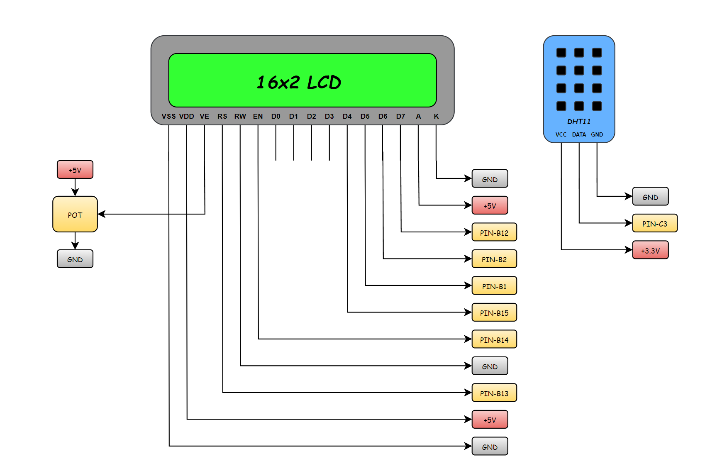
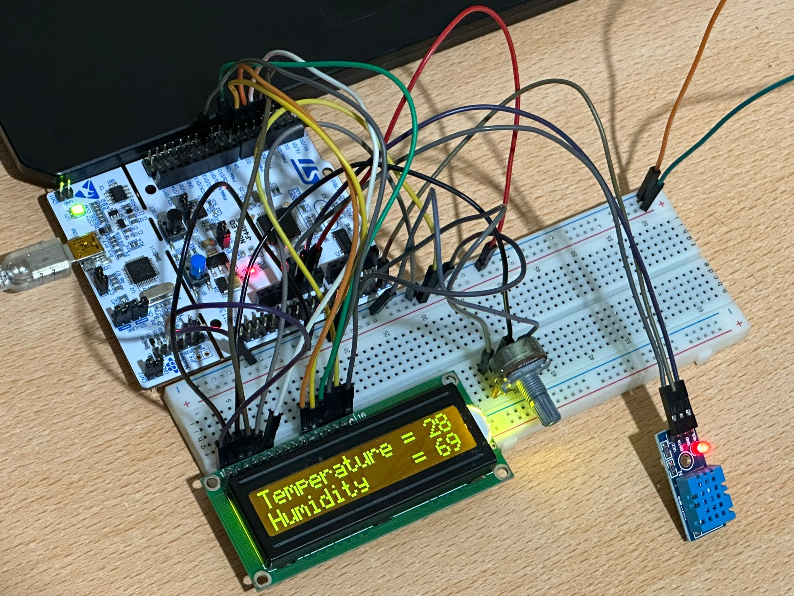

# Driver Development of DHT11 Sensor on STM32

# ⚡ What is DHT11 Sensors?

The DHT11 Sensor is an electronic temperature and humidity measurement device that uses a capacitive humidity sensor and a thermistor to detect environmental conditions. It works by measuring the relative humidity in the air and the ambient temperature, then converting this data into a digital signal. 

# 🔥 How to Use DHT11 Sensor with Microcontrollers?

Using the DHT11 sensor with a microcontroller involves connecting its VCC, GND, and Data pins to the microcontroller, then programming it to read the digital signal sent by the sensor.

Typically, the microcontroller sends a start signal to the DHT11, waits for its response, and then reads the transmitted data, which includes temperature and humidity values. This allows the microcontroller to monitor and display environmental conditions for various applications.

# 🛠️ Electrical Diagram

- **VCC (Pin 1)** 
Power supply pin, typically connected to +5V (can also work with 3.3V on some boards).

- **DATA (Pin 2)** 
Serial data pin. Used to communicate temperature and humidity readings with the microcontroller.

- **GND (Pin 3)** 
Ground connection (GND). It serves as the reference voltage for the circuit.

In this application, the STM32 Nucleo F446RE development board was used. You can refer to the above wiring diagram.

# 🚀 Code Explanation

<pre><code class="language-c">void DHT11_init(volatile GPIO_TypeDef* DATA_GPIO, volatile uint16_t DATA_PIN);
</code></pre>

Initializes the DHT11 sensor by configuring the DATA pin for STM32. Enables the GPIO clock, sets the specified pin as output and input, and drives it HIGH as required by the DHT11 communication protocol.

<pre><code class="language-c">void DHT11_Start(void);
</code></pre>

Sends the start signal to the DHT11 sensor to initiate communication.
Enables the GPIO clock, configures the DATA pin as output, and pulls it LOW for at least 18 ms to notify the sensor. Then switches the DATA pin back to input mode and waits 30 µs for the DHT11’s response signal.

<pre><code class="language-c">SensorState_t DHT11_checkResponse(void);
</code></pre>

Checks the response signal from the DHT11 sensor after the start condition.
Waits 40 µs, then verifies if the DATA pin goes LOW, indicating the sensor has detected the start request. If LOW is detected, it waits another 80 µs and checks for a HIGH signal.

<pre><code class="language-c">uint8_t DHT11_read(SensorState_t state);
</code></pre>

Reads one byte (8 bits) of data from the DHT11 sensor after a successful response.

# 🖥️ Test Highlights

You can easily test the DHT11 sensor using the following code snippet

<pre><code class="language-c">#include "main.h"
#include "DHT11.h"
#include "LCD.h"
#include "stdio.h"

extern DHT11_TypeDef_t DHT11;

char bufferDistance_temperature[50];
char bufferDistance_humidity[50];

int main(void)
{
    HAL_Init();
    SystemClock_Config();
    MX_GPIO_Init();
    DHT11_init(GPIOC, GPIO_PIN_3);
    LCD_InitStruct(GPIOB, GPIO_PIN_15,
		                 GPIOB, GPIO_PIN_1,
			         GPIOB, GPIO_PIN_2,
			         GPIOB, GPIO_PIN_12,
			         GPIOB, GPIO_PIN_14,
			         GPIOB, GPIO_PIN_13);
    LCD_clear();

    while (1)
    {
       DHT11_Start();
       DHT11.sensorState = DHT11_checkResponse();
       DHT11.RH_Bytes[0] = DHT11_read(DHT11.sensorState);
       DHT11.RH_Bytes[1] = DHT11_read(DHT11.sensorState);
       DHT11.Temp_Bytes[0] = DHT11_read(DHT11.sensorState);
       DHT11.Temp_Bytes[1] = DHT11_read(DHT11.sensorState);
       DHT11.sumBytes = DHT11_read(DHT11.sensorState);

       DHT11.temperature = DHT11.Temp_Bytes[0];
       DHT11.humidity = DHT11.RH_Bytes[0];
       DELAY_MS(1200);

       sprintf(bufferDistance_temperature, "Temperature = %.0f", DHT11.temperature);
       sprintf(bufferDistance_humidity, "Humidity    = %.0f", DHT11.humidity);

       LCD_clear();
       LCD_setCursor(1, 1);
       LCD_writeString(bufferDistance_temperature);
       DELAY_MS(1);
       LCD_setCursor(2, 1);
       LCD_writeString(bufferDistance_humidity);
       DELAY_MS(250);
    }
}
</code></pre>

## 🎉 Thank You for Reviewing!

Thank you for taking the time to check out this project.

Feel free to follow me on these platforms for more updates and projects.

- YouTube: @mnane34

- LinkedIn: Mertcan Nane